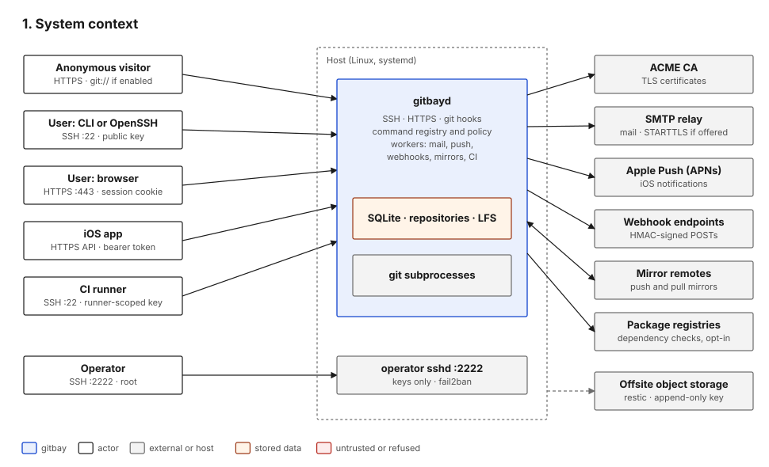

#+title: System context

* What gitbay is

A self-hosted git forge: repositories, issues, merge requests, reviews,
CI, releases, wikis, snippets and notifications. One Go binary
(=gitbayd=), one SQLite database, and the system =git= binary for all
repository operations.

The design rule that shapes everything else: *SSH is the API*. Every
operation is a control command in one registry
(=internal/control/control.go=). Stock OpenSSH reaches all of them; the
CLI, the web UI and the JSON API are clients of the same registry and
do not reimplement logic (=internal/httpd/control.go=,
=internal/httpd/api.go=).

* Actors

| Actor                 | Reaches gitbay through                        | Authenticates with                  |
|-----------------------+-----------------------------------------------+-------------------------------------|
| Anonymous visitor     | HTTPS pages, smart HTTP fetch, git:// if on   | nothing                             |
| Registered user       | SSH (CLI or stock OpenSSH), HTTPS web, API    | SSH key; web session; API token     |
| Instance administrator| same as a user, plus host shell               | SSH key with admin account; root    |
| Deploy key holder     | SSH git transport for one repository          | SSH key bound to that repository    |
| CI runner             | SSH, =runner= commands and clone              | SSH key with =runner= scope         |
| iOS app               | JSON API over HTTPS; receives APNs pushes     | API token pasted at sign-in         |
| Webhook receiver      | receives HTTPS POSTs from gitbay              | verifies HMAC-SHA256 signature      |

* External systems

| System                    | Direction | Purpose                                   | Code                               |
|---------------------------+-----------+-------------------------------------------+------------------------------------|
| ACME CA (Let's Encrypt)   | out       | TLS certificates                          | =cmd/gitbayd/main.go=       |
| SMTP relay                | out       | verification, login links, notifications  | =internal/mail/mail.go=            |
| Apple Push Notification   | out       | iOS notifications                         | =internal/push/apns.go=            |
| Webhook endpoints         | out       | event delivery, user-configured           | =internal/webhook/webhook.go=      |
| Mirror remotes            | out / in  | push and pull mirrors, user-configured    | =internal/mirror/mirror.go=        |
| Package registries        | out       | dependency update checks (opt-in per repo)| =internal/deps/registry.go=  |
| Offsite object storage    | out       | restic backups (host timer, not gitbayd)  | documented: Admin wiki             |

gitbayd makes no other outbound connection: no telemetry or update
check.

* Instance modes that change the attack surface

| Setting                          | Default   | Effect                                                      |
|----------------------------------+-----------+-------------------------------------------------------------|
| =web.mode=                       | view_only | =accounts= adds login, settings and every web write route (=routes.go=) |
| =api.enabled=                    | false     | when false there is no credential-bearing HTTP surface       |
| =registration.mode=              | closed    | =open= admits unknown SSH keys to =register=; =invite= needs a code |
| =git_daemon.enabled=             | false     | anonymous =git://= on 9418                                  |
| =push.enabled=                   | false     | APNs worker and device registration                          |
| =http.tls=                       | acme      | =files= or =off=; =off= also drops HSTS and the cookie Secure flag |
| =webhooks.allow_local=           | false     | when false, webhook and mirror URLs may not resolve to private or loopback addresses |

gitbay.org runs with =web.mode = accounts=, the API enabled and
=registration.mode = open=, all three observable from outside (=/login=,
=/register=, =/api/v1/read= answering 401).
