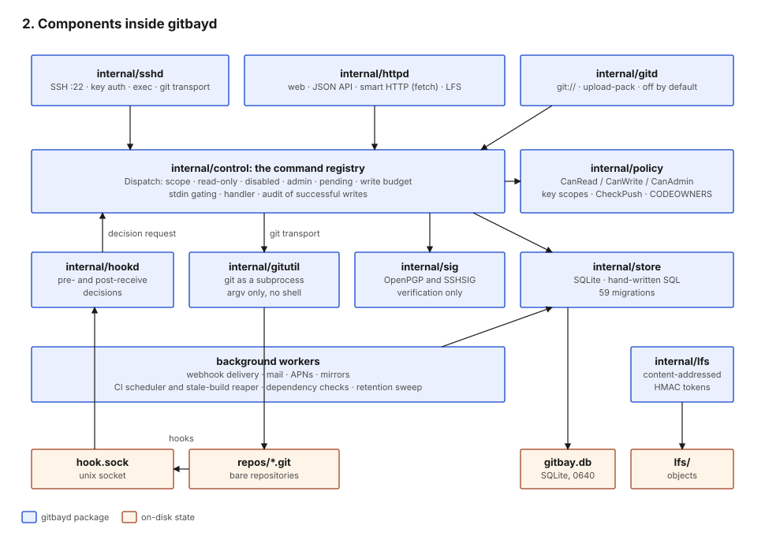

#+title: Components

* Binaries

| Binary          | Role                                                                 | Entry                         |
|-----------------+----------------------------------------------------------------------+-------------------------------|
| =gitbayd=       | daemon: listeners, workers, git hooks, admin and maintenance         | =cmd/gitbayd/main.go=          |
| =gitbay=        | end-user CLI; a thin client that runs control commands over SSH      | =cmd/gitbay/main.go=, =ssh.go= |
| =gitbay-runner= | CI runner; claims builds over SSH and runs them, normally in podman  | =cmd/gitbay-runner/main.go=    |

=gitbayd= subcommands: =serve=, =check-config=, =migrate=, =admin=,
=authorized-keys= and =shell= (for =ssh.mode = system=), =version=, and
the hidden =hook= used by git (=cmd/gitbayd/main.go=,
=cmd/gitbayd/hook.go=).

* Packages

| Package              | Responsibility                                                                 |
|----------------------+--------------------------------------------------------------------------------|
| =internal/control=   | The command registry and every handler. The only place business rules live.    |
| =internal/policy=    | Access predicates (=CanRead/CanWrite/CanAdmin=), key scopes, push rules, CODEOWNERS, reserved names. |
| =internal/store=     | SQLite access, hand-written SQL, migrations (=internal/store/migrations/=).      |
| =internal/sshd=      | SSH listener, public-key auth, session exec, dispatch to git transport or registry, LFS bridge. |
| =internal/httpd=     | HTTPS: web UI, smart HTTP (fetch only), LFS HTTP, JSON API, login, security headers. |
| =internal/hookd=     | Unix-socket server answering git's pre-receive and post-receive hooks.          |
| =internal/gitutil=   | Subprocess wrappers around =git=. No git library is linked.                     |
| =internal/sig=       | Verification of OpenPGP and SSHSIG commit and tag signatures. Verification only. |
| =internal/gitd=      | Anonymous =git://= daemon, upload-pack only, off by default.                    |
| =internal/ci=        | =.gitbay/ci.yml= parsing, cron schedules, the scheduler and stale-build reaper. |
| =internal/lfs=       | Content-addressed LFS store and HMAC transfer tokens.                           |
| =internal/webhook=   | Outbound webhook delivery with SSRF checks, HMAC signing, retries.              |
| =internal/mirror=    | Push and pull mirror worker.                                                   |
| =internal/gitpin=    | Resolves and checks a user-supplied http(s) remote and pins git to the checked addresses; mirror sync and =repo import=. |
| =internal/notify=, =internal/mail= | Mail queue drain and SMTP.                                      |
| =internal/push=      | APNs queue drain and provider-token signing.                                    |
| =internal/deps=      | Dependency manifest parsing and registry checks (opt-in per repository).        |
| =internal/config=    | Configuration load and validation.                                             |
| =internal/web=       | Embedded templates, stylesheet and fonts.                                      |
| =internal/protocol=  | Exit codes, JSON envelope, argv tokenizer.                                     |

* The command registry

Every capability is a =Command= (=internal/control/control.go=):

| Field        | Meaning                                                             |
|--------------+---------------------------------------------------------------------|
| =Path=       | noun and verb, e.g. =keys add=                                      |
| =Flags=      | parsed by one parser for every command (=internal/control/flags.go=)|
| =ReadsStdin= | the only way a handler receives stdin; otherwise stdin is emptied   |
| =ReadOnly=   | safe for read-scoped tokens and =GET /api/v1/read=; tested to write nothing |
| =Run=        | the handler                                                         |

Every surface builds a =Ctx= and calls =Dispatch=
(=internal/control/control.go=):

| Surface      | =Ctx.Source=      | =Ctx.Scope=            | =Ctx.ReadOnly=      | Code                              |
|--------------+-------------------+------------------------+---------------------+-----------------------------------|
| SSH          | key fingerprint   | the key's scope        | false               | =internal/sshd/sshd.go= (=Exec=) |
| Web          | =web=             | =full=                 | false               | =internal/httpd/control.go=        |
| JSON API     | =api=             | =full=                 | token scope = read  | =internal/httpd/api.go=, =apiread.go= |
| Host (root)  | =host=            | =full=                 | false               | =cmd/gitbayd= admin subcommands    |

=Dispatch= applies, in order: =--term= and =--json= stripping; the scope
gate; the read-only gate; the disabled-account gate; the =admin= noun
gate; the pending-account gate; the per-account write budget; stdin
gating; the handler; and an audit row for every successful mutating
command. Details in [[file:05-Identity-and-Access.org][5. Identity and access]].

* Background workers

Started by =gitbayd serve= (=cmd/gitbayd/main.go=):

| Worker                | Starts when                 | Trigger                         | Queue / table         |
|-----------------------+-----------------------------+---------------------------------+-----------------------|
| Webhook delivery      | always                      | 2 s poll                        | =webhook_deliveries=  |
| Mail                  | =mail.smtp_host= set        | 2 s poll                        | =notifications=       |
| APNs push             | =push.enabled=              | 2 s poll                        | =push_queue=          |
| Mirrors               | always                      | 10 s tick, per-mirror interval  | =mirrors=             |
| CI scheduler          | always                      | 1 min tick; reaps stale builds  | =build_schedules=, =builds= |
| Dependency checks     | always (repos opt in)       | =deps.check_interval_hours=     | =dep_checks=          |
| Retention sweep       | always                      | hourly                          | sessions, tokens, retained tables |
| Pending-account reaper| =registration.pending_expiry= set | hourly                    | =users=               |

* Git hooks

Repositories carry generated hook scripts (mode 0755, regenerated at
startup, =internal/hookd/hookd.go=) that run
=gitbayd hook pre-receive|post-receive=. The hook process connects to
the daemon's Unix socket (=<root>/hook.sock=, =hookd.go=) and asks
for a decision; the daemon holds the policy. See
[[file:04-Trust-Boundaries.org][4. Trust boundaries]], flow B.
