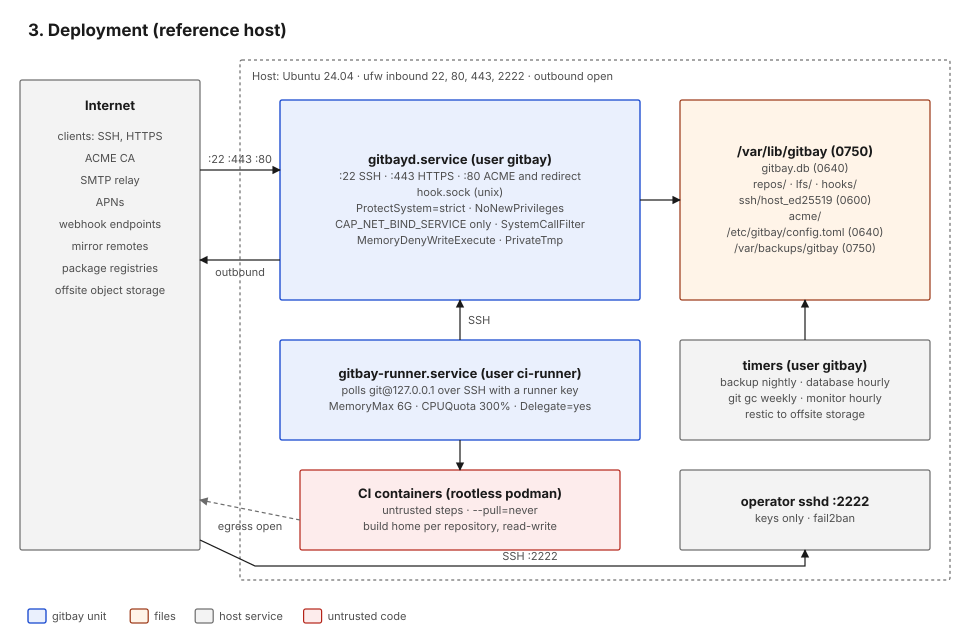

#+title: Deployment and network

The reference deployment is one Linux host built from
=deploy/cloud-init.yaml=, with the daemon installed by =make deploy=
(=deploy/install.sh=) and the CI runner by =make deploy-runner=. The
statements in this document about the host rest on those files.

* Listeners

| Port / path          | Protocol          | Owner      | Default     | Auth                                   | Code                                  |
|----------------------+-------------------+------------+-------------+----------------------------------------+---------------------------------------|
| 22/tcp               | SSH               | gitbayd    | on          | public key; unknown keys only reach =register= when registration is open | =cmd/gitbayd/main.go=, =internal/sshd/sshd.go= |
| 443/tcp              | HTTPS             | gitbayd    | on          | none for pages; session cookie; bearer token for the API | =cmd/gitbayd/main.go=        |
| 80/tcp               | HTTP              | gitbayd    | on with ACME| none; ACME HTTP-01 and redirect only   | =cmd/gitbayd/main.go=         |
| 9418/tcp             | git://            | gitbayd    | off         | none; public repositories only         | =internal/gitd=                       |
| 2222/tcp             | SSH (operator)    | host sshd  | on          | public key, no passwords, fail2ban     | =deploy/cloud-init.yaml=        |
| =<root>/hook.sock=   | Unix socket       | gitbayd    | on          | mode 0600; peer uid must be the daemon's (Linux); per-push token | =internal/hookd/hookd.go= |

With =ssh.mode = system= the host's sshd serves port 22 instead and
invokes =gitbayd authorized-keys= and =gitbayd shell=
(=cmd/gitbayd/main.go=).

HTTP server limits: =ReadHeaderTimeout= 10 s, =IdleTimeout= 2 min,
=MaxHeaderBytes= 64 KiB, no =WriteTimeout= so long git transfers and
live build logs can stream (=cmd/gitbayd/main.go=).

There is no metrics endpoint. =/healthz= reports the deployed commit and
a database check.

* Processes and accounts

| Unit                   | User        | Hardening (from the unit files)                                                                   |
|------------------------+-------------+---------------------------------------------------------------------------------------------------|
| =gitbayd.service=      | =gitbay=    | =CAP_NET_BIND_SERVICE= only; =NoNewPrivileges=; =ProtectSystem=strict= with write access to =/var/lib/gitbay= and =/var/backups/gitbay= only; =ProtectHome=; =PrivateTmp=; =PrivateDevices=; kernel, clock and cgroup protections; =RestrictNamespaces=; =MemoryDenyWriteExecute=; =RestrictAddressFamilies=AF_INET AF_INET6 AF_UNIX=; =SystemCallFilter=@system-service= (=deploy/cloud-init.yaml=) |
| =gitbay-runner.service=| =ci-runner= | =MemoryMax=6G=, =CPUQuota=300%=, =Delegate=yes=, =KillMode=mixed=, =RestrictSUIDSGID=yes=. =NoNewPrivileges=, =ProtectKernelTunables= and =ProtectControlGroups= are relaxed because rootless podman needs =newuidmap=, a proc mount and a writable delegated cgroup; the reasons are in =deploy/gitbay-runner.override.conf= |
| CI containers          | subordinate uids of =ci-runner= | rootless podman, =--pull=never=, operator-provisioned image; see [[file:07-CI-and-Supply-Chain.org][7. CI]] |
| backup, db-backup, gc, monitor timers | =gitbay= | nightly full archive, hourly database snapshot, weekly =git gc=, hourly health heartbeat (=deploy/cloud-init.yaml=) |

* Filesystem

| Path                              | Contents                                   | Mode set by code / deploy |
|-----------------------------------+--------------------------------------------+---------------------------|
| =/var/lib/gitbay= (=server.root=) | everything below                           | 0750 (cloud-init)         |
| =<root>/gitbay.db=                | SQLite database                            | 0640 (=internal/store/store.go=) |
| =<root>/repos/<owner>/<name>.git= | bare repositories                          | process umask             |
| =<root>/lfs=                      | LFS objects, content-addressed             | 0755 directories (=internal/lfs/lfs.go=) |
| =<root>/ssh/host_ed25519=         | SSH host key                               | 0600 in a 0700 directory (=internal/sshd/sshd.go=) |
| =<root>/acme=                     | ACME account key and certificates          | autocert defaults         |
| =<root>/hooks=                    | generated hook scripts                     | 0755                      |
| =/etc/gitbay/config.toml=         | configuration, including SMTP password     | 0640 (cloud-init)         |
| =/var/backups/gitbay=             | backup archives                            | 0750 (cloud-init)         |

* Outbound connections from gitbayd

| Destination            | Trigger                       | TLS                                          | Guard                                                          |
|------------------------+-------------------------------+----------------------------------------------+----------------------------------------------------------------|
| ACME directory         | certificate issue and renewal | yes                                          | host policy limits names to the site and claimed pages domains (=main.go=) |
| SMTP relay             | queued mail                   | STARTTLS required for a non-local relay, or implicit TLS | =mail.require_tls=; Go's =PlainAuth= will not send credentials over plaintext to a non-local host (=internal/mail/mail.go=) |
| APNs                   | queued push                   | yes, HTTP/2                                  | provider token signed with the operator's .p8 key              |
| Webhook URLs           | recorded events               | yes when https; certificate verified         | private, shared, loopback, link-local and multicast targets refused at save and again at connect time; no redirects (=internal/webhook/webhook.go=) |
| Mirror URLs            | mirror schedule               | per URL                                      | address check at save and before each sync; git pinned to the checked addresses, no redirects (=internal/mirror/mirror.go=) |
| Package registries     | dependency checks             | yes                                          | fixed hosts; only the package name varies (=internal/deps/registry.go=) |

* Host firewall

=deploy/cloud-init.yaml= opens 22, 80, 443 and 2222 inbound with ufw.
Outbound traffic is not restricted, including from CI containers. See
[[file:10-Known-Gaps.org][10. Known gaps]].

* Change path

1. A signed commit merged to =main= through a merge request (direct
   pushes to =main= are refused by =require-mr=).
2. =make deploy= refuses a dirty tree (=Makefile= =preflight=), builds
   with the commit stamped in, copies the binary over operator SSH,
   runs =gitbayd check-config=, restarts the unit
   (=deploy/install.sh=).
3. =/healthz= reports the commit now serving.
