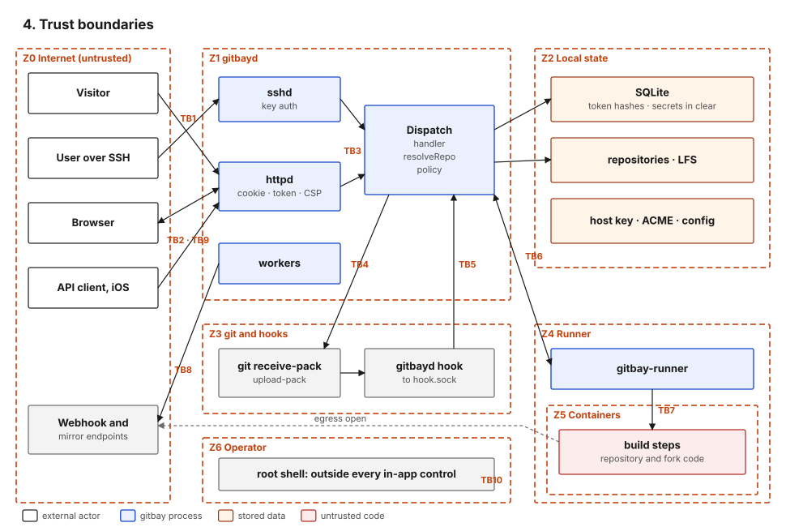
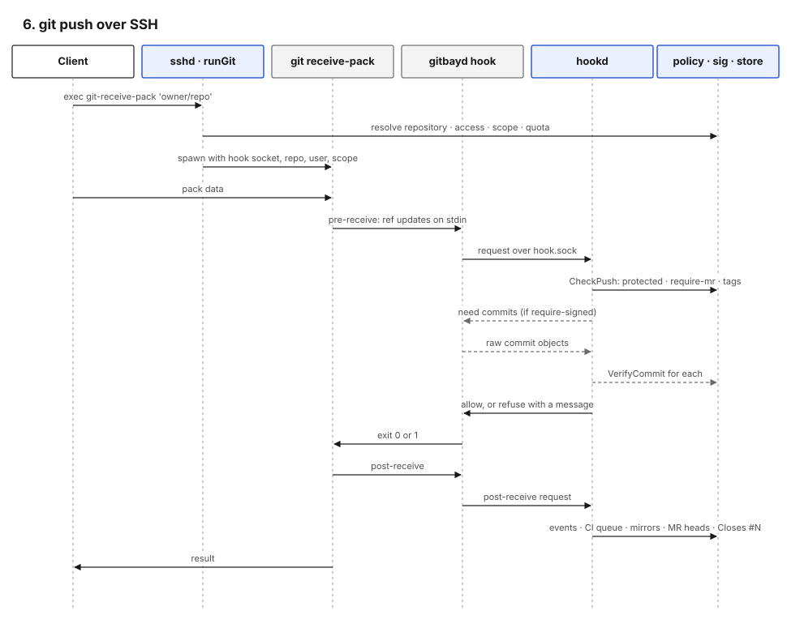

#+title: Trust boundaries and data flows

* Zones

| Zone | Contents                                                        | Trust                                                     |
|------+-----------------------------------------------------------------+-----------------------------------------------------------|
| Z0   | The internet: visitors, clients, webhook and mirror endpoints   | none                                                      |
| Z1   | gitbayd process                                                 | holds all policy; trusted                                 |
| Z2   | Local state: SQLite, repositories, LFS, keys, config           | trusted; readable by the =gitbay= user                    |
| Z3   | git subprocesses and hook processes                             | run as =gitbay= on data from Z0; their decisions come from Z1 |
| Z4   | CI runner service                                               | trusted to report honestly; holds secrets for trusted builds |
| Z5   | CI containers                                                   | untrusted code from repositories and forks                |
| Z6   | Operator host access                                            | root; outside every in-application control                |

* Boundaries

| ID  | Boundary                           | What crosses                                     | Control at the boundary                                                                 |
|-----+------------------------------------+--------------------------------------------------+-----------------------------------------------------------------------------------------|
| TB1 | Z0 → Z1 SSH                        | key auth, exec requests, git packs               | public-key auth, per-IP failure limit (=internal/sshd/sshd.go=, =ratelimit.go=); unknown keys reach only =register= |
| TB2 | Z0 → Z1 HTTPS                      | page requests, form posts, API calls, fetches, LFS | TLS; session cookie or bearer token; =checkOrigin= on posts; CSP and security headers (=internal/httpd/routes.go=); smart HTTP is fetch-only (=smart.go=) |
| TB3 | identity → data                    | every command                                    | =Dispatch= gates, then =resolveRepo= with =policy= predicates; unreadable repositories are indistinguishable from missing ones ([[file:05-Identity-and-Access.org][5]]) |
| TB4 | Z1 → Z3 git                        | argv, repository path, stdin packs               | argv built by code, never a shell; repository path from the database, not the request (=internal/gitutil=) |
| TB5 | Z3 → Z1 hook socket                | ref updates, repository id, user id, key scope, push token, commit objects | the socket is mode 0600 and, on Linux, refuses a peer whose uid is not the daemon's; a request must carry the token sshd minted for its receive-pack (stored hashed in =push_tokens=) and name the same repository, account and scope. The daemon then decides with =policy.CheckPush= and =sig.VerifyCommit= (=internal/hookd/hookd.go=) |
| TB6 | Z4 ↔ Z1 runner channel             | build claims (with secrets for trusted builds), logs, results | runner-scoped SSH key; claims limited to attached repositories; secrets only when the build is trusted (=internal/control/build.go=) |
| TB7 | Z5 → Z4 container                  | build steps, workspace, build home               | rootless podman, operator-provisioned image, cgroup limits; the build home is shared per repository and the network is open (#255, #260) |
| TB8 | Z1 → Z0 outbound                   | webhooks, mirrors, mail, push                    | address checks on user-supplied URLs; HMAC on webhooks; no redirects ([[file:03-Deployment.org][3]]) |
| TB9 | user content → browser             | Markdown and Org bodies, READMEs, filenames      | HTML sanitised (=ugcHTML=, =internal/httpd/web.go=, bluemonday); CSP =script-src 'none'= |
| TB10| Z6 → everything                    | host shell                                       | operator SSH on 2222, keys only, fail2ban; append-only offsite backup credentials |

* Flows

Each flow lists its hops in order. Boundary IDs refer to the table
above.

** A. SSH control command

1. Client opens SSH; =authenticate= looks up the key fingerprint and
   records user id, key id and scope in the connection
   (=internal/sshd/sshd.go=). TB1.
2. Each exec request: =runExec= reloads the account, touches the key's
   last-used time, calls =Exec= (=sshd.go=).
3. =Exec= tokenizes the command line (no shell) and routes git
   transport verbs to =runGit=, everything else to =control.Dispatch=
   with =Source= set to the key fingerprint (=sshd.go=).
4. =Dispatch= gates and runs the handler; mutating successes are
   audited (=internal/control/control.go=). TB3.

** B. git push over SSH

1. =runGit= resolves the repository, applies the deploy-key or account
   checks, archive and pull-mirror refusals and the owner's storage
   quota (=sshd.go=). TB3.
2. =git receive-pack= runs with the hook socket path, repository id,
   user id and key scope in its environment, and a push token (=sshd.go=). TB4.
3. git runs =pre-receive=, which is =gitbayd hook pre-receive=. It
   reads the ref updates, computes ancestry in git's quarantine
   environment and asks the daemon over the socket
   (=cmd/gitbayd/hook.go=). TB5.
4. The daemon applies =policy.CheckPush= (protected branches,
   =require-mr=, protected tags, server-owned =refs/merge-requests/*=)
   and, when the repository requires signed commits, asks for every
   incoming commit object and verifies each
   (=internal/hookd/hookd.go=).
5. On refusal the hook exits 1 and git rejects the push atomically.
6. On success git runs =post-receive=; the daemon records events,
   marks mirrors dirty, queues CI, syncs merge request heads, processes
   =Closes #N= references and audits force pushes
   (=hookd.go=).

The server's own merge of a merge request does not pass through the
hooks: =runMRMerge= updates the ref with a compare-and-swap
(=internal/control/mr.go=) after =MergeGates=
(=mr.go=). When signed commits are required only fast-forward
merges are allowed, so the server never writes an unsigned commit
(=mr.go=).

** C. Fetch over smart HTTP

=GET info/refs= and =POST git-upload-pack= serve public repositories
only; a private repository answers 404. =git-receive-pack= over HTTP
always answers a pkt-line refusal, so there is no password prompt and
no HTTP write path (=internal/httpd/smart.go=,
=routes.go=). TB2.

** D. Web read and write

1. The session cookie is hashed and looked up (=accounts.go=).
2. Pages dispatch read commands into the registry with =Source=web= and
   decode the JSON result into the template (=internal/httpd/control.go=).
3. Form posts pass =checkOrigin= (=accounts.go=), dispatch the
   matching command, and map the exit code to a redirect or an error on
   the page. Three toggles (pin, watch, mark read) write the store
   directly instead (#261).

** E. JSON API

1. =apiAuth= hashes the bearer token and looks it up; any failure is a
   uniform 401 (=internal/httpd/api.go=).
2. Per-account rate limit, with writes at a tenth of the read budget.
3. =POST /api/v1/cmd= dispatches any command except git transport;
   =GET /api/v1/read= refuses anything not marked =ReadOnly=, so a GET
   cannot write (=apiread.go=).
4. Exit codes map to HTTP status: 0→200, 2→400, 3→404, 4→403, else 500.

** F. LFS

=git-lfs-authenticate= over SSH applies the same repository checks as
git transport and returns a one-hour HMAC token scoped to repository
and operation (=internal/sshd/lfs.go=, =internal/lfs/lfs.go=). The
HTTP batch, upload and download endpoints verify that token; public
repositories allow anonymous download. Objects are verified against
their SHA-256 id on upload.

** G. Browser login by emailed link

1. =/login= takes a username or email; per-IP and per-account limits
   (5 per hour) apply, and every non-eligible case returns the same
   response (=internal/control/loginlink.go=).
2. A 32-byte token is mailed; only its hash is stored, valid 15 minutes.
3. =/login?token== consumes it atomically, rechecks the account and
   sets the session cookie (=accounts.go=).

=ssh git@host web login= mints the same kind of link, valid 5 minutes,
to an already-authenticated key (=internal/control/web.go=).

** H. CI build

See [[file:07-CI-and-Supply-Chain.org][7. CI and supply chain]].
