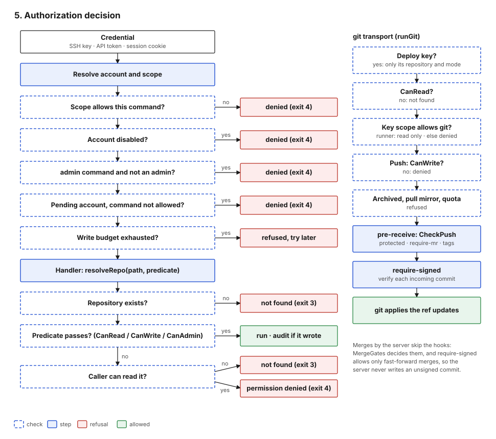

#+title: Identity and access

* Accounts

| Property     | Values / behaviour                                                                  | Code |
|--------------+-------------------------------------------------------------------------------------+------|
| Registration | =closed= (host bootstrap only), =invite= (single-use code bound to an email), =open= (email required) | =internal/control/register.go= |
| Pending      | open registrations start pending until email is verified; a pending account may run only =email verify=, =email add=, =whoami=, =help=, and has no git access | =internal/control/control.go=, =internal/sshd/sshd.go= |
| Disabled     | refused in =Dispatch=, in SSH exec and at login-link redemption                     | =control.go= |
| Admin        | =users.is_admin=; set only by =admin user create --admin= or promotion by an admin; gates the whole =admin= noun | =control.go= |

* Credentials

| Credential         | Format and generation                           | Stored as                        | Scope                                      | Expiry                        | Revocation                          |
|--------------------+-------------------------------------------------+----------------------------------+--------------------------------------------+-------------------------------+-------------------------------------|
| SSH user key       | user's public key                               | fingerprint and public blob      | =full=, =git=, or =runner=                 | none                          | =keys remove= (own keys); closes its connections |
| Deploy key         | public key                                      | same table, scope =deploy:<repo>:ro/rw= | one repository, read or read-write  | none                          | =repo deploy-key remove= (repo admin); closes its connections |
| API token          | =gb_= + 32 random bytes hex                     | SHA-256 hash                     | =full= or =read=                           | optional =--ttl=              | =token revoke=                      |
| Web session        | 32 random bytes hex, cookie =gitbay_session=    | SHA-256 hash                     | full account                               | 7 days, no sliding renewal    | logout, =web sessions revoke=       |
| Login link         | 32 random bytes hex in a URL                    | SHA-256 hash, single use         | creates a web session                      | 15 min (mail), 5 min (SSH)    | consumed on use                     |
| Email verification | 32 random bytes hex                             | SHA-256 hash, single use         | verifies one address for one account       | 24 h                          | consumed on use                     |
| Invite             | random code                                     | SHA-256 hash, single use         | one registration for one email             | as issued                     | consumed on use                     |
| LFS transfer token | HMAC-SHA256 over repo, operation, expiry        | not stored (stateless)           | one repository, upload or download         | 1 h                           | expiry only                         |

Generation and hashing: =internal/store/sessions.go= (=NewToken=,
=HashToken=, =crypto/rand=). Cookie attributes: =HttpOnly=,
=SameSite=Lax=, =Secure= unless TLS is off, =MaxAge= 7 days
(=internal/httpd/accounts.go=). Token scope values are
constrained by a database =CHECK= as well as the command
(=internal/store/migrations/0004_api_tokens.up.sql=).

What the scopes allow:

| Scope          | Control commands                | git transport                     |
|----------------+---------------------------------+-----------------------------------|
| =full= key     | all the account may run         | read and write                    |
| =git= key      | none                            | read and write                    |
| =runner= key   | =runner *= only, on attached repositories | read (clone)            |
| =deploy:*= key | none                            | its repository only, =ro= or =rw= |
| =full= token   | all the account may run         | not over the API                  |
| =read= token   | commands marked =ReadOnly=      | not over the API                  |

Sources: =internal/control/control.go=,
=internal/policy/access.go=.

* Authorization decision

Two layers decide every request.

1. *=Dispatch=* (=internal/control/control.go=), in order:
   scope gate, read-only gate, disabled account, =admin= noun, pending
   account, per-account write budget, stdin gating, handler, audit.
2. *The handler*, which resolves the repository with =resolveRepo=
   (=internal/control/repo.go=) and a predicate from
   =internal/policy/access.go=:

| Predicate  | True when                                                                |
|------------+--------------------------------------------------------------------------|
| =CanRead=  | owner; or the repository is public; or a grant of read, write or admin   |
| =CanWrite= | owner; or a grant of write or admin                                      |
| =CanAdmin= | owner; or a grant of admin                                               |

Grants come from =repo_access= rows for users, organizations and teams.
Organization-owned repositories have no individual owner; members get
access only through grants.

Not found versus denied: when the predicate fails, =resolveRepo=
checks =CanRead=. If the caller cannot read the repository the answer is
"not found", identical to a missing repository. Only a caller who can
read it gets "permission denied" for a write. git transport follows the
same rule (=internal/sshd/sshd.go=), and so does smart HTTP, which
serves public repositories only.

Deploy keys bypass the grant model entirely: =runGit= checks only that
the key's scope names this repository and allows the operation
(=policy.DeployScopeAllows=, =internal/policy/access.go=).

* Repository write protections

Enforced in the pre-receive hook, so they apply to every credential
that reaches git transport (=internal/policy/access.go=,
=internal/hookd/hookd.go=):

| Setting (=repo settings …=) | Effect                                                                  |
|---------------------------+-------------------------------------------------------------------------|
| =protect=                 | no deletion, no force push on the branch                                |
| =require-mr=              | no direct push to an existing protected branch; only the server's merge writes it |
| =protect-tag=             | no deletion or move of matching tags                                    |
| =require-signed=          | every incoming commit must verify (OpenPGP or SSHSIG) against a key registered to a verified email |
| (always)                  | =refs/merge-requests/*= is server-owned                                 |

Merge gates, evaluated by =MergeGates= for =mr merge=, the web merge
button and the displayed status (=internal/control/mr.go=):

| Gate                  | Satisfied when                                                              |
|-----------------------+-----------------------------------------------------------------------------|
| draft                 | the merge request is not a draft (always on)                                |
| =require-checks=      | every status on the head is success, and some status exists if CI would have run |
| =require-approvals N= | N fresh approvals from current writers other than the author, and no active request for changes |
| =require-codeowners=  | every changed path matching a CODEOWNERS rule has an approval from a listed owner |
| =require-resolved=    | no unresolved review threads                                                |

* Session security on the web

- CSRF: =SameSite=Lax= withholds the cookie on cross-site posts;
  =checkOrigin= rejects a post whose =Origin= host differs from the
  request host (=internal/httpd/accounts.go=).
- Headers on every response: CSP =default-src 'self'; script-src
  'none'; style-src 'self' 'unsafe-inline'; img-src * data:;
  object-src 'none'; base-uri 'none'; form-action 'self';
  frame-ancestors 'none'=, =X-Frame-Options: DENY=, =nosniff=,
  =Referrer-Policy: no-referrer=, =Cross-Origin-Opener-Policy:
  same-origin=, and HSTS for one year with subdomains when TLS is on
  (=internal/httpd/routes.go=).
- Destructive web actions (key, email and PGP removal, release, snippet,
  team and label deletion, user disable and demote) require the target's
  name typed into the form (=internal/httpd/confirm.go=).

* Rate limits

| Limit                   | Default           | Keyed by              | Code                                  |
|-------------------------+-------------------+-----------------------+---------------------------------------|
| SSH auth failures       | 10 per minute     | client IP             | =internal/sshd/ratelimit.go=          |
| API requests            | 120 per minute    | account, or IP if anonymous | =internal/httpd/apilimit.go=    |
| API writes              | a tenth of the above | same               | =apilimit.go=                   |
| Command writes, all surfaces | =limits.write_rate= (60 per minute) | account | =internal/control/control.go= |
| Login links (web form)  | 5 per hour, plus per-IP | account and IP  | =internal/control/loginlink.go= |
| Email verification mails| 5 per hour        | account               | =internal/control/register.go=    |

=X-Forwarded-For= is honoured only from addresses listed in
=http.trusted_proxies= (=internal/httpd/apilimit.go=).
