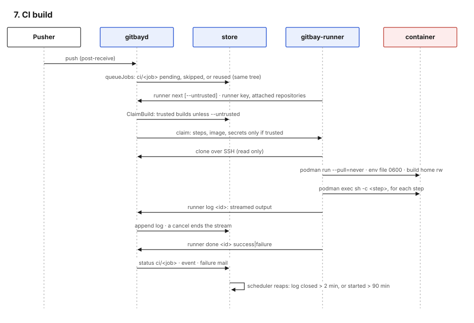

#+title: CI and supply chain

* Pipeline definition

=.gitbay/ci.yml= at the pushed commit (=internal/ci/ci.go=):

| Limit / rule                 | Value                                                         |
|------------------------------+---------------------------------------------------------------|
| jobs per file                | 10                                                            |
| steps per job                | 50, each at most 4096 bytes                                   |
| path filters                 | 50 each for =paths= and =paths-ignore=                        |
| job name                     | =^[a-z0-9][a-z0-9_-]{0,39}$=                                  |
| image                        | a restricted reference; it becomes a podman argument, so no whitespace or shell characters (=ci.go=) |
| triggers                     | push, merge request, =schedule= (cron), =tags= (glob)         |

A file that does not parse sets a =ci/config= failure status on the
commit instead of failing silently.

* Build lifecycle

1. *Queue.* The post-receive hook calls =queueJobs=
   (=internal/control/build.go=). Each job gets a =ci/<job>= status:
   =pending= when queued, =skipped= when path filters exclude it, or
   =success= copied from an earlier build of the same tree (#177).
   Merge requests from forks are queued against the target repository
   with =trusted = false=.
2. *Claim.* A runner calls =runner next= over SSH
   (=build.go=). Allowed for a =runner=-scoped key or an admin; a
   runner key claims only for repositories it is attached to with
   =repo runner add=. Untrusted builds are claimable only by a runner
   started with =-untrusted= (=internal/store/builds.go=). The
   claim returns id, repository, job, commit, ref, steps, image, the
   build's trust, and — for trusted builds only — the repository's secrets
   (=build.go=).
3. *Run.* The runner clones over SSH into =build-<id>=, starts a
   container and runs each step with =podman exec … sh -c <step>=
   (=cmd/gitbay-runner/isolate.go=).
4. *Log.* =runner log <id>= streams stdin into the build row; the server
   ends the stream if the build is cancelled (=build.go=).
5. *Result.* =runner done <id> success|failure= sets the status,
   records an event and mails the repository's watchers a log tail on
   failure (=build.go=).
6. *Reap.* The scheduler fails a running build whose log stream closed
   more than 2 minutes ago, or that started more than 90 minutes ago
   (=internal/store/builds.go=).

Who may do what:

| Action                             | Requirement                                    |
|------------------------------------+------------------------------------------------|
| =build list/show/log/jobs=         | read on the repository                         |
| =build trigger=, =build cancel=    | write on the repository                        |
| =repo secret set/remove/list=      | admin on the repository                        |
| =repo runner add/remove=           | admin on the repository                        |
| =runner next/log/done=             | =runner= key attached to the repository, or admin |
| =status set=                       | write on the repository (any context name; #258) |

* Runner isolation

| Control                    | Implementation                                                             |
|----------------------------+----------------------------------------------------------------------------|
| Isolation mode             | =podman= by default; =none= must be chosen explicitly and logs a warning; an unknown value or missing prerequisites refuse start (=isolate.go=) |
| Container runtime          | rootless podman under the =ci-runner= user and its subordinate uid range   |
| Image                      | =--pull=never=; images are built by the operator (=deploy/Containerfile.ci=) and referenced by tag |
| Workspace                  | =<workdir>/build-<id>=, removed after the build; workdir must be 0700 and owned by the runner (=main.go=) |
| Build home                 | trusted: =<workdir>/trusted-home/<owner>/<name>=, one per repository, persistent; untrusted: =<workdir>/build-<id>-home=, removed with the build (=main.go=) |
| Secrets                    | env file 0600 outside the workspace, or =--env NAME= for multi-line values |
| Resources                  | per-build cgroup with =memory.max= and =cpu.max= written by the runner; unit-level =MemoryMax=6G=, =CPUQuota=300%= |
| Network                    | podman default (pasta); outbound unrestricted (#260)                        |
| Shutdown                   | SIGTERM stops claiming and drains in-flight builds; the unit uses =KillMode=mixed= |

* Integrations

| Integration | Trigger              | Security properties                                                            |
|-------------+----------------------+--------------------------------------------------------------------------------|
| Webhooks    | recorded events      | SSRF checks at save and connect time, no redirects, HMAC-SHA256 signature, 5 attempts with exponential backoff, response body capped at 4 KiB (=internal/webhook/webhook.go=) |
| Mirrors     | schedule             | address check at save and before each sync, git pinned to the checked addresses, no redirects; token via =GIT_ASKPASS= script (0700); heads and tags only; 10-minute timeout (=internal/mirror/mirror.go=) |
| Dependency checks | schedule, opt-in | fixed registry hosts; package names restricted (=internal/deps/registry.go=) |

* The project's own supply chain

| Stage          | Control                                                                                     |
|----------------+---------------------------------------------------------------------------------------------|
| Source         | krz/gitbay on the instance itself; signed commits required, fast-forward merges only; =require-mr= on =main= |
| Dependencies   | 15 direct Go modules (=go.mod=); pure-Go SQLite (=modernc.org/sqlite=), no cgo              |
| CI             | =build= (build, vet) and =test= (full suite against real git, ssh, sshd, gpg) on every push; =vuln= (govulncheck) nightly and before release (=.gitbay/ci.yml=) |
| Static checks  | =deploy/audit.sh=: vet, govulncheck, short fuzz runs of the pkt-line, commit, signature, PGP key and tokenizer parsers |
| Build          | =CGO_ENABLED=0 -trimpath -ldflags='-s -w -buildid='= for reproducible binaries; the commit is stamped in (=deploy/release.sh=, =Makefile=) |
| Release        | =SHA256SUMS= for every binary; a minisign signature of the manifest when the release key is present (optional) |
| Distribution   | release assets on the forge; Homebrew formula in krz/homebrew-tap built from the tag; push mirror to GitHub (read-only copy) |
| Deploy         | =make deploy= refuses a dirty tree, then copies, checks config and restarts over operator SSH |
| CI image       | built on the host from =deploy/Containerfile.ci= (=golang:1.27-trixie= plus git-lfs, gnupg, openssh, python3, sqlite3); tagged, never pulled at build time |
